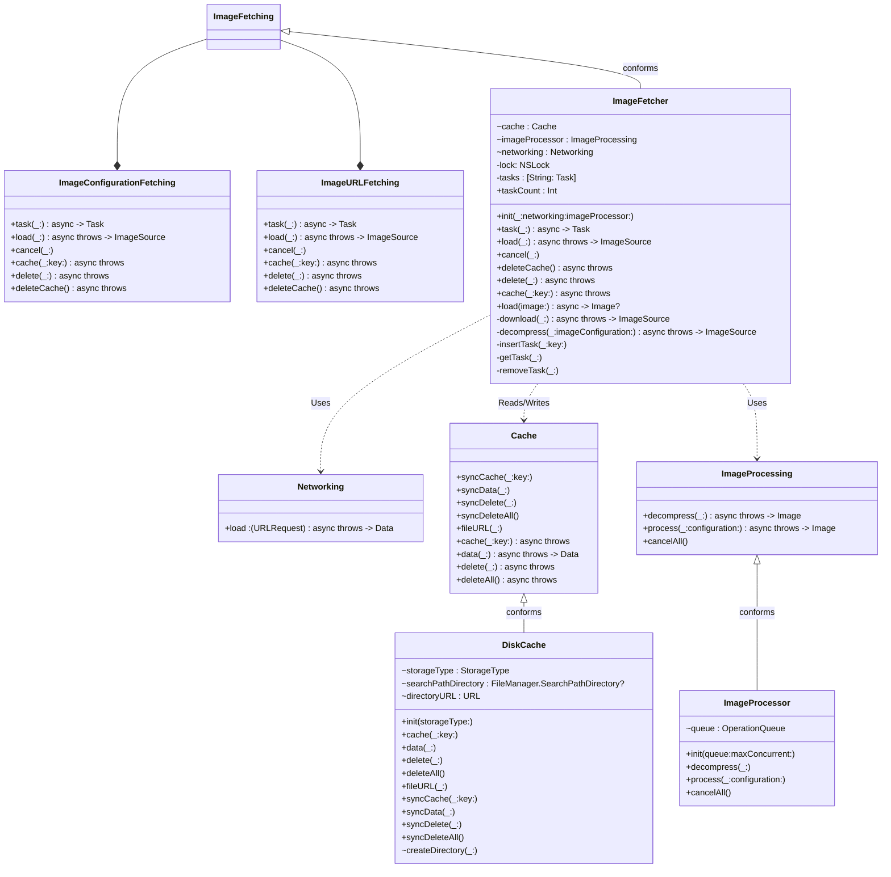
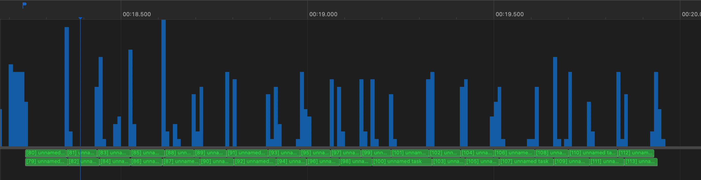
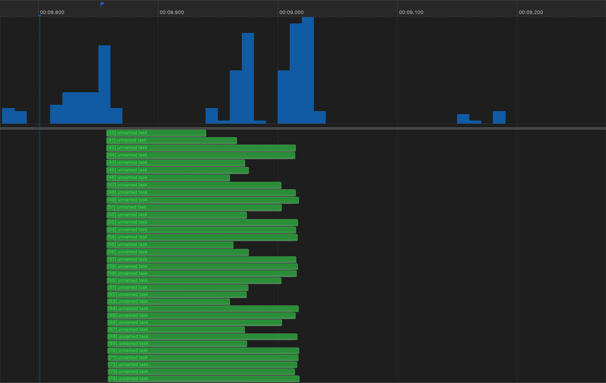

# Adopt Swift Concurrency for Networking

## Architecture



### Components

#### `ImageFetching`

The library would continue to provide an `ImageFetching` protocol that is a composition of `ImageURLFetching` and `ImageConfigurationFetching`. These protocols would be updated to look like the following:

```swift
public protocol ImageConfigurationFetching {
    func task(_ imageConfiguration: ImageConfiguration) async -> Task<ImageSource, Error>
    func load(_ imageConfiguration: ImageConfiguration) async throws -> ImageSource
    func cancel(_ imageConfiguration: ImageConfiguration)
    func cache(_ image: Image, key: ImageConfiguration) async throws
    func delete(_ imageConfiguration: ImageConfiguration) async throws
    func deleteCache() async throws

    subscript (_ imageConfiguration: ImageConfiguration) -> Task<ImageSource, Error>? { get }
}
```

Where `ImageSource` is a renamed, non-generic version of `ResultType`:

```swift
public enum ImageSource {
    case cached(Image)
    case downloaded(Image)

    public var value: Image {
        switch self {
        case .cached(let value):
            return value
        case .downloaded(let value):
            return value
        }
    }
}
```

Given that I would expect all future uses of `ImageFetcher` to take advantage of Swift Concurrency, I propose dropping the synchronous methods currently offered by `ImageFetching` as maintaining them would add additional complexity and impose an unnecessary maintenance burden. I made `load(_:)` throwing to match the conventions of most async methods. I will discuss the substitution of `Task` for `ImageFetcherTask` below.

#### `Cache`

No major changes here; using the async methods of `DiskCache`'s `Cache` protocol. I anticipate using the [`MockCache` implementation](https://github.com/Mobelux/ImageFetcher/blob/0853f94b411b035b7f414bc8d562dcf5bbdbdaa5/Tests/ImageFetcherTests/Helpers.swift#L103-L165) added in [#14](https://github.com/Mobelux/ImageFetcher/pull/14).

#### `Networking`

A simple struct with a `load` member would replace the current `DataOperation` dependency. It would be based on `URLSession.data(for:)` and would validate the response before returning the image data:

```swift
public struct Networking {
    public let load: (URLRequest) async throws -> Data
}
```

This solution adds support for cooperative cancellation and will be very easy to mock during testing:

```swift
enum Mock {
    static let data = Data()
}

extension Networking {
    static var mock = Networking { _ in
        Mock.data
    }
}
```

#### `ImageProcessing`

I propose adding an `ImageProcessing` object that would be responsible for decompressing / editing images. This would use `OperationQueue` with a configurable `maxConcurrentOperationCount`:

```swift
public protocol ImageProcessing {
    func decompress(_ data: Data) async throws -> Image
    func process(_ data: Data, configuration: ImageConfiguration) async throws -> Image
}
```

Until custom executors are supported it seems that Swift Concurrency doesn't really support any attempt to limit the number of threads dedicated to a particular task / set of tasks. The main idea behind this separate object is to abstract this usage of the older concurrency model.

I do expect (and preliminary testing seems to indicate) the cooperative thread pool to be good at handling network requests and cooperative task cancellation.

There are a number of different ways to resize images that offer different tradeoffs; NSHipster [discusses 5 of them in this post](https://nshipster.com/image-resizing/), for example. By specifying an `ImageProcessing` protcol we allow library consumers to define an alternatice implementation where different performance considerations warrant it. It also permits the implementation of a mock version for testing.

## Notable Changes

### The Collection of Active and Pending Tasks

This proposal includes a change to the collection of active / pending tasks used, in part, to support the `ImageFetcher.cancel(_:)` method that deserves additional discussion:

- Current: `var tasks: Set<ImageFetcherTask>`
- Proposed: `var tasks: Dictionary<String, Task<ImageSource, Error>>`

#### Current `tasks` Implementation

In the current implementation each call to `ImageFetcher.task(_:)` and `.load(_:)` creates a new task if the requested resource is not cached. That means that if two different sections of code request the same resource and one subsequently cancels its request, the other is unaffected. However, that also means the caller is responsible for preventing duplicate requests in cases where that is likely to be a concern.

The `ImageFetcherTask` provides access to the `configuration`, `handler`, and `result` of a given operation. While it seems like it should be very unlikely, this present a potential thread-safety issue as it is possible for the caller to try reading a task’s `result` on one thread while the underlying `Operation`’s `completionBlock` mutates the task’s `result` on another thread or for the caller to mutate its `configuration` or `handler` member while it is being read on another thread.

#### Proposed `tasks` Implementation

This proposal changes the `tasks` collection to a `Dictionary` and first checks for an active/pending for the requested configuration before checking for a cached image or requesting one. This absolves the caller of responsibility for preventing duplicate requests, but it also means that any call to cancel an active / pending request cancels it for all callers.

I replaced `ImageFetcherTask` by providing direct access to the underlying `Task`, which offers access to the request’s eventual value and a `cancel()` method. The result is more restricted but safer since we remove possibility of concurrently reading/writing task members.

`ImageFetcher` will use an `NSLock` to ensure thread-safe access to `tasks`. I considered making it an `actor` but that seems like overkill when we only need to protect `tasks` and all access to it will be very quick.

### Managing Concurrency

This proposal also removes the ability to limit concurrent requests and cache lookups via `maxConcurrent` by making the cooperative thread pool responsible for managing those operations. Instead, `maxConcurrent` is limited to controlling concurrent processing of image data ultimately performed by the `Image.decompress(...)` method. I reasoned that this represents the most expensive operation performed by `ImageFetcher` and the one the OS is least suited to manage. [Previous efforts](https://github.com/Mobelux/ImageFetcher/pull/6#issuecomment-1115291685) at limiting concurrency outside of an `OperationQueue` were not especially fruitful.

## Performance

The proposed design only tries to limit concurrency when processing images. I used both the current and the proposed library to load images from JSONPlaceholder in a collection view:


I profiled this on an iPad Pro with `maxConcurrent = 2` for both libraries to compare performance and resource usage.

### Current Implementation

CPU Usage (via Time Profiler) and Requests:


Zoomed out to fit all requests:



Activity per CPU:


### Proposed Implementation

CPU Usage (via Time Profiler) and Requests:



Activity per CPU:


Task Detail:


